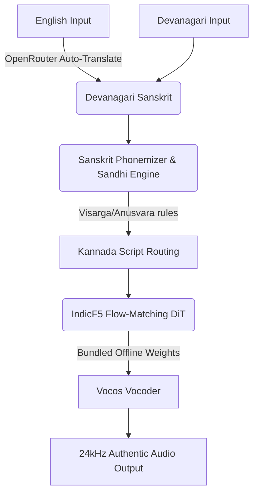

<div align="center">
  <h1>🕉️ EdgeSanskrit-TTS</h1>
  <h3>The Ultimate Offline Sanskrit Chanting & Text-to-Speech Engine</h3>
  
  [](https://opensource.org/licenses/MIT)
  [](https://www.python.org/downloads/)
  [](https://huggingface.co/Hari7718/EdgeSanskrit-TTS)
  [](https://fastapi.tiangolo.com/)

  <p align="center">
    <b>Translate English to Sanskrit • Generate Authentic Chants • Run 100% Offline on CPU</b>
  </p>
</div>

---

## 🌟 Overview

**EdgeSanskrit-TTS** is a high-speed, dependency-free Sanskrit Text-to-Speech (TTS) engine designed to run efficiently on the **edge** (CPUs, local machines, and low-resource environments). 

Unlike standard Hindi TTS models that suffer from the "schwa-deletion" problem (pronouncing *Rama* as *Ram*), EdgeSanskrit uses **true Sanskrit phonetics, strict sandhi rules, and zero-shot voice cloning** via the **IndicF5** architecture to produce authentic, temple-grade Sanskrit chanting.

### 🎧 Audio Samples
* **[▶️ Play Vishnu Sahasranama (Anushtubh Meter)](https://github.com/Hariprajwal/EdgeSanskrit/blob/main/v2_vishnu.mp4)**
* **[▶️ Play Bhagavad Gita 1.1 (Anushtubh Meter)](https://github.com/Hariprajwal/EdgeSanskrit/blob/main/v2_gita_1_1.mp4)**

---

## ✨ Key Features

- ⚡ **Ultra-Fast Local CPU Inference**: Highly optimized for standard CPUs (NFE=12). No expensive GPUs required.
- 🔌 **100% Offline-First**: Gigabytes of weights (`IndicF5` and `Vocos`) are bundled natively in the HuggingFace Model Repo. Clone it and run it completely offline—no internet required.
- 🕉️ **True Sanskrit Phonetics**: Retains all short vowels and handles visarga echoing (`नमः` → *namaha*) and homorganic anusvaras (`अहंकार` → *ahaṅkāra*).
- 🌐 **Beautiful Web UI included**: Comes with a premium FastAPI + HTML/JS web interface with a glassmorphism design.
- 🧠 **Auto-Translation Pipeline**: Type in English → Auto-translates to Devanagari (via LLMs) → Synthesizes authentic audio.

---

## 🚀 Quickstart Guide

This repository contains **everything** (code + gigabytes of AI model weights). 

### 1. Clone the complete Offline Bundle (via HuggingFace)
Because GitHub blocks files over 100MB, the full offline package is hosted on HuggingFace.
*(Ensure you have [Git LFS](https://git-lfs.com/) installed)*

```bash
# Clone the repo (Downloads ~1.5GB of code and models)
git clone https://huggingface.co/Hari7718/EdgeSanskrit-TTS
cd EdgeSanskrit-TTS
```

### 2. Install Dependencies
```bash
# Install IndicF5 directly from the AI4Bharat repository
pip install "git+https://github.com/ai4bharat/IndicF5.git@13f7c4d627cc10111aea8fe9c0039462cacacdc7"

# Install other requirements
pip install -r requirements.txt
```

### 3. Launch the Web UI
Start the beautiful local web server:
```bash
uvicorn app:app --host 127.0.0.1 --port 8000 --reload
```
Open your browser to `http://127.0.0.1:8000` to access the UI!

---

## 💻 CLI Usage

If you prefer the command line, you can generate audio directly using the provided python scripts.

### Basic Sanskrit Generation
```bash
python generate_sanskrit_v2.py "धर्मक्षेत्रे कुरुक्षेत्रे समवेता युयुत्सवः" --meter anushtubh --output chant.wav
```

### English → Sanskrit → Audio Pipeline
Want to type in English? Add your OpenRouter API key to `.env` (`OPENROUTER_API_KEY=sk-or-...`) and run:
```bash
python generate_from_english.py --text "The warrior stands on the battlefield of Kurukshetra" --output dramatic_chant.wav
```

---

## 🛠️ Architecture & Pipeline

EdgeSanskrit utilizes a state-of-the-art Flow-Matching Diffusion Transformer (DiT).



### Why IndicF5 over standard TTS?
| Feature | Standard Hindi TTS | EdgeSanskrit (IndicF5) |
| :--- | :--- | :--- |
| **Schwa Deletion** | ❌ Yes (Cuts words short) | ✅ No (Authentic pronunciations) |
| **Prosody & Tone** | ❌ Flat / Conversational | ✅ Real Chanting (zero-shot cloning) |
| **Text Routing** | ❌ Devanagari → IPA | ✅ Devanagari → Kannada mapping |

---

## 🤝 Credits & Attribution

EdgeSanskrit stands on the shoulders of these incredible open-source projects:

1. **[IndicF5](https://github.com/ai4bharat/IndicF5)** by **AI4Bharat**: Multilingual flow-matching speech generator that powers the zero-shot voice cloning.
2. **[Vāgdhenu](https://github.com/prathoshap/vagdhenu)** by **Prof. Prathosh (IISc, Bengaluru)**: The pioneer Sanskrit chant TTS system from which we drew the key linguistic rules and reference audio.
3. **[Kokoro TTS](https://github.com/hexgrad/kokoro)** by **hexgrad**: The ultra-lightweight architecture that originally inspired our edge-CPU approach.

---
*Built with ❤️ for Sanskrit and Open Source AI.*
