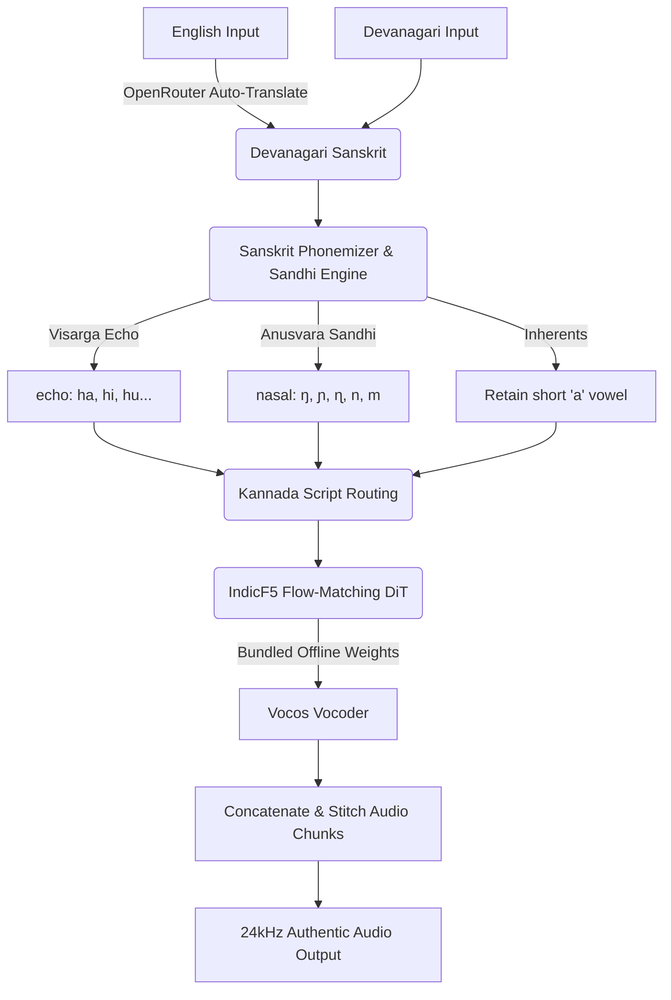

<div align="center">
  <h1>🕉️ EdgeSanskrit-TTS</h1>
  <h3>The Ultimate Offline Sanskrit Chanting & Text-to-Speech Engine</h3>
  
  [](https://opensource.org/licenses/MIT)
  [](https://www.python.org/downloads/)
  [](https://huggingface.co/Hari7718/EdgeSanskrit-TTS)
  [](https://fastapi.tiangolo.com/)

  <p align="center">
    <b>Translate English to Sanskrit • Generate Authentic Chants • Run 100% Offline on CPU</b>
  </p>
</div>

---

## 🌟 Overview

**EdgeSanskrit-TTS** is a high-speed, dependency-free Sanskrit Text-to-Speech (TTS) engine designed to run efficiently on the **edge** (CPUs, local machines, and low-resource environments). 

It achieves **faster-than-real-time CPU inference** while delivering high-quality Sanskrit pronunciation, bypassing complex OS-level dependencies (like `espeak-ng`) and solving the classic **Hindi schwa-deletion** issue (pronouncing *Rama* as *Ram*).

### 🎧 Audio Samples (Phase 2 - CPU Inference)
* **[▶️ Play Vishnu Sahasranama Invocation (Anushtubh Meter)](https://github.com/Hariprajwal/EdgeSanskrit/blob/main/v2_vishnu.mp4)**
* **[▶️ Play Bhagavad Gita 1.1 (Anushtubh Meter)](https://github.com/Hariprajwal/EdgeSanskrit/blob/main/v2_gita_1_1.mp4)**

---

## ✨ Key Features

*   ⚡ **Ultra-Fast Local CPU Inference**: Powered by Flow-Matching DiTs and StyleTTS architectures, it generates speech in less than half the time of the spoken audio on standard CPUs. No GPU required!
*   🔌 **100% Offline-First Package**: Gigabytes of weights (`IndicF5` and `Vocos`) are bundled natively in the HuggingFace Model Repo. Clone it and run it completely offline.
*   🚫 **Zero OS-Level Dependencies**: Bypasses system-level phonemizer libraries that frequently fail or hang in Windows/macOS/Linux environments.
*   🕉️ **True Sanskrit Phonetics (No Schwa Deletion)**: Hindi TTS engines delete final and inherent consonants' short vowels. EdgeSanskrit preserves all Sanskrit short vowels unless explicitly cancelled by a virama (`्`).
*   🔊 **Sandhi & Phonological Optimization**:
    *   **Visarga Echoing**: Final visargas (`ः`) are echoed with the preceding vowel (e.g., `नमः` $\rightarrow$ `namaha`, `श्रीपतिः` $\rightarrow$ `śrīpatihi`).
    *   **Homorganic Anusvara**: Anusvaras (`ं`) are resolved to their matching varga nasal consonant depending on the following letter (Velar $\rightarrow$ `ŋ`, Palatal $\rightarrow$ `ɲ`, Retroflex $\rightarrow$ `ɳ`, Dental $\rightarrow$ `n`, Labial $\rightarrow$ `m`).
*   🌐 **Premium Web UI**: Comes with a gorgeous, glassmorphism-styled FastAPI + HTML/JS web interface for immediate local use.
*   🧠 **Auto-Translation Pipeline**: Type in English → Auto-translates to Devanagari via a multi-model LLM fallback chain (Gemini Flash → Claude Haiku → Mistral 7B) → Synthesizes authentic audio.

---

## 🚦 Quickstart Guide

This repository contains **everything** (code + gigabytes of AI model weights). Because GitHub blocks files over 100MB, the full offline package is hosted on HuggingFace.

### 1. Clone the complete Offline Bundle
*(Ensure you have [Git LFS](https://git-lfs.com/) installed)*
```bash
# Downloads ~1.5GB of code and models
git clone https://huggingface.co/Hari7718/EdgeSanskrit-TTS
cd EdgeSanskrit-TTS
```

### 2. Install Dependencies
```bash
# Install IndicF5 directly from the AI4Bharat repository fork
pip install "git+https://github.com/ai4bharat/IndicF5.git@13f7c4d627cc10111aea8fe9c0039462cacacdc7"

# Install other requirements
pip install -r requirements.txt
```

### 3. Launch the Web UI
Start the beautiful local web server:
```bash
uvicorn app:app --host 127.0.0.1 --port 8000 --reload
```
Open your browser to `http://127.0.0.1:8000` to access the UI!

---

## 💻 CLI Usage

If you prefer the command line, you can generate audio directly using the provided python scripts.

### Basic Sanskrit Generation
```bash
python generate_sanskrit_v2.py "धर्मक्षेत्रे कुरुक्षेत्रे समवेता युयुत्सवः" --meter anushtubh --output chant.wav
```

### English → Sanskrit → Audio Pipeline
Want to type in English? Add your OpenRouter API key to `.env` (`OPENROUTER_API_KEY=sk-or-...`) and run:
```bash
python generate_from_english.py --text "The warrior stands on the battlefield of Kurukshetra" --output dramatic_chant.wav
```

---

## 🛠️ Architecture & Pipeline

EdgeSanskrit utilizes a state-of-the-art Flow-Matching Diffusion Transformer (DiT). 



### Why IndicF5 over standard TTS?

| Feature | Standard Hindi TTS | EdgeSanskrit (IndicF5) |
| :--- | :--- | :--- |
| **Parameters** | 82M | 337M |
| **Voice source** | Conversational Hindi | Real Sanskrit chanting (Prof. Prathosh, IISc) |
| **Prosody & Tone** | Flat / Conversational | Zero-shot cloning of swara, pace & timbre |
| **Schwa Deletion** | ❌ Yes (Cuts words short) | ✅ No (Authentic pronunciations) |
| **Text Routing** | Devanagari → IPA | Devanagari → **Kannada** |

The key insight: **the "authentic Indian touch" comes from the reference audio**, not just the model. The reference WAVs in our bundled bank are recordings of an actual Sanskrit chanter. IndicF5 clones the voice timbre, pitch contour (swara), and chanting rhythm from those 5-12 second clips for any new verse.

---

## 📋 Direct Phoneme Mapping Scheme

Sanskrit is completely phonetic. The phonemizer maps Devanagari characters using the following rules:

### Vowels & Vowel Signs
| Devanagari | Dependent Sign | IPA Translation |
| :--- | :--- | :--- |
| अ | - | `a` |
| आ | ा | `aː` |
| इ | ि | `i` |
| ई | ी | `iː` |
| उ | ु | `u` |
| ऊ | ू | `uː` |
| ऋ | ृ | `ɾɪ` |
| ए | े | `e` |
| ऐ | ै | `aɪ` |
| ओ | ो | `o` |
| औ | ौ | `aʊ` |
| ऽ | - | `ː` (Length Mark) |

### Consonant Vargas (Velar to Labial)
| Varga | Unvoiced (Unasp / Asp) | Voiced (Unasp / Asp) | Nasal |
| :--- | :--- | :--- | :--- |
| **Velar** | क (`k`), ख (`kʰ`) | ग (`ɡ`), घ (`ɡʰ`) | ङ (`ŋ`) |
| **Palatal** | च (`tʃ`), छ (`tʃʰ`) | ज (`dʒ`), झ (`dʒʰ`) | ञ (`ɲ`) |
| **Retroflex** | ट (`ʈ`), ठ (`ʈʰ`) | ड (`ɖ`), ढ (`ɖʰ`) | ण (`ɳ`) |
| **Dental** | त (`t`), थ (`tʰ`) | द (`d`), ध (`dʰ`) | न (`n`) |
| **Labial** | प (`p`), फ (`pʰ`) | ब (`b`), भ (`bʰ`) | म (`m`) |

### Semivowels & Sibilants
*   **Semivowels**: य (`j`), र (`r`), ल (`l`), व (`v`)
*   **Sibilants**: श (`ʃ`), ष (`ʂ`), स (`s`), ह (`h`)

---

## 📊 Benchmarks on CPU

Tested using Bhagavad Gita Verse 1.1 (*Anushtubh Meter*):
> *धर्मक्षेत्रे कुरुक्षेत्रे समवेता युयुत्सवः । मामकाः पाण्डवाश्चैव किमकुर्वत संजय ॥*

*   **Audio Duration**: ~9.1 seconds
*   **Inference Time (NFE=12)**: ~7.3 seconds
*   **Real-Time Factor (RTF)**: **~0.8x** (generates faster than speech)
*   **Hardware**: Standard CPU, single thread

---

## 🤝 Credits & Attribution

EdgeSanskrit stands on the shoulders of these incredible open-source projects:

1. **[IndicF5](https://github.com/ai4bharat/IndicF5)** by **AI4Bharat**: Multilingual flow-matching speech generator that inspired the phoneme structures, Indic script routing, and zero-shot cloning.
2. **[Vāgdhenu](https://github.com/prathoshap/vagdhenu)** by **Prof. Prathosh (IISc, Bengaluru)**: The pioneer Sanskrit chant Text-to-Speech system, from which we drew the key linguistic rules (visarga sandhi, homorganic anusvara), reference bank mapping, and script architecture insights.
3. **[Kokoro TTS](https://github.com/hexgrad/kokoro)** by **hexgrad**: The ultra-lightweight 82M parameter StyleTTS2-based model that originally inspired the fast edge CPU speech synthesis architecture.

---
*Built with ❤️ for Sanskrit, Vedas, and Open Source AI.*
