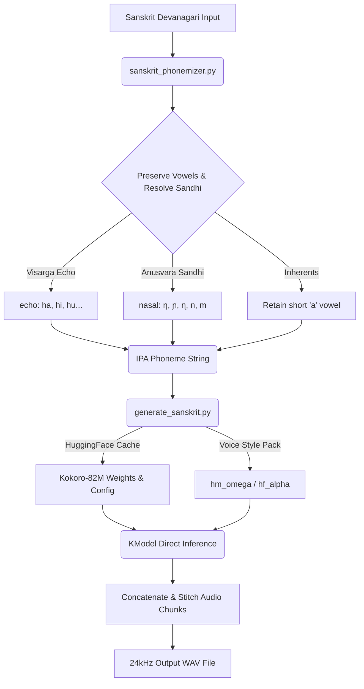

# EdgeSanskrit ☸️

**EdgeSanskrit** is a high-speed, dependency-free Sanskrit Text-to-Speech (TTS) engine designed to run efficiently on the **edge** (CPUs, local machines, and low-resource environments).

It achieves **faster-than-real-time CPU inference** while delivering high-quality Sanskrit pronunciation, bypassing complex OS-level dependencies (like `espeak-ng`) and solving the classic **Hindi schwa-deletion** issue.

---

### 🎧 Authentic Sanskrit Chanting (Phase 2 - CPU Inference)
**Vishnu Sahasranama Invocation (Anushtubh):**
<br>
<video src="https://github.com/Hariprajwal/EdgeSanskrit/raw/main/v2_vishnu.mp4" controls="controls"></video>

**Bhagavad Gita 1.1 (Anushtubh):**
<br>
<video src="https://github.com/Hariprajwal/EdgeSanskrit/raw/main/v2_gita_1_1.mp4" controls="controls"></video>

---

## 🚀 Key Features

*   ⚡ **Ultra-Fast Local CPU Inference**: Powered by StyleTTS2, it generates speech in **less than half the time of the spoken audio** on standard CPUs (RTF $\approx$ 0.55). No GPU required.
*   🚫 **Zero OS-Level Dependencies**: Bypasses the `espeak-ng` system library (which frequently fails or hangs in local Windows/macOS/Linux environments) by utilizing a direct, rules-based Python phonetic transliterator.
*   🕉️ **True Sanskrit Phonetics (No Schwa Deletion)**: Hindi TTS engines delete final and inherent consonants' short vowels (e.g., *rama* $\rightarrow$ *ram*). EdgeSanskrit preserves all Sanskrit short vowels unless explicitly cancelled by a virama (`्`).
*   🔊 **Sandhi & Phonological Optimization**:
    *   **Visarga Echoing**: Final visargas (`ः`) are echoed with the preceding vowel (e.g., `नमः` $\rightarrow$ `namaha`, `श्रीपतिः` $\rightarrow$ `śrīpatihi`, `गुरुः` $\rightarrow$ `guruhu`).
    *   **Homorganic Anusvara**: Anusvaras (`ं`) are resolved to their matching varga nasal consonant depending on the following letter (Velar $\rightarrow$ `ŋ`, Palatal $\rightarrow$ `ɲ`, Retroflex $\rightarrow$ `ɳ`, Dental $\rightarrow$ `n`, Labial $\rightarrow$ `m`).
*   📦 **Clause Chunking & Stitching**: Automatically handles long texts and multi-line verses by splitting them on punctuation boundaries, performing batched synthesis, and stitching the audio buffers with natural pauses.

---

## 🛠️ Architecture & Pipeline



---

## 📋 Direct Phoneme Mapping Scheme

Sanskrit is completely phonetic. The phonemizer maps Devanagari characters to Kokoro's internal **International Phonetic Alphabet (IPA)** vocabulary:

### Vowels & Vowel Signs
| Devanagari | Dependent Sign | IPA Translation |
| :--- | :--- | :--- |
| अ | - | `a` |
| आ | ा | `aː` |
| इ | ि | `i` |
| ई | ी | `iː` |
| उ | ु | `u` |
| ऊ | ू | `uː` |
| ऋ | ृ | `ɾɪ` |
| ए | े | `e` |
| ऐ | ै | `aɪ` |
| ओ | ो | `o` |
| औ | ौ | `aʊ` |
| ऽ | - | `ː` (Length Mark) |

### Consonant Vargas (Velar to Labial)
| Varga | Unvoiced (Unasp / Asp) | Voiced (Unasp / Asp) | Nasal |
| :--- | :--- | :--- | :--- |
| **Velar** | क (`k`), ख (`kʰ`) | ग (`ɡ`), घ (`ɡʰ`) | ङ (`ŋ`) |
| **Palatal** | च (`tʃ`), छ (`tʃʰ`) | ज (`dʒ`), झ (`dʒʰ`) | ञ (`ɲ`) |
| **Retroflex** | ट (`ʈ`), ठ (`ʈʰ`) | ड (`ɖ`), ढ (`ɖʰ`) | ण (`ɳ`) |
| **Dental** | त (`t`), थ (`tʰ`) | द (`d`), ध (`dʰ`) | न (`n`) |
| **Labial** | प (`p`), फ (`pʰ`) | ब (`b`), भ (`bʰ`) | म (`m`) |

### Semivowels & Sibilants
*   **Semivowels**: य (`j`), र (`表达`), ल (`l`), व (`v`)
*   **Sibilants**: श (`ʃ`), ष (`ʂ`), स (`s`), ह (`h`)

---

## 🚦 Quickstart Guide

### Prerequisites

Ensure you have Python 3.10+ and standard PyTorch (CPU version is fine) installed:

```bash
pip install kokoro huggingface_hub numpy soundfile loguru
```

### Installation

Clone the repository and verify the setup:

```bash
git clone https://github.com/Hariprajwal/EdgeSanskrit.git
cd EdgeSanskrit
python test_run.py
```

### Script Usage

To synthesize custom Sanskrit text, run the command-line generator:

```bash
python generate_sanskrit.py "धर्मक्षेत्रे कुरुक्षेत्रे समवेता युयुत्सवः" -o output.wav -v hm_omega -s 1.0
```

#### Arguments:
- `text`: Your input Sanskrit string in Devanagari.
- `-o`, `--output` (Default: `sanskrit_output.wav`): Target file path.
- `-v`, `--voice` (Default: `hm_omega`): Kokoro Hindi voice model (`hm_omega` for male, `hf_alpha` for female).
- `-s`, `--speed` (Default: `1.0`): Speech rate multiplier.

---

## 📊 Benchmarks on CPU

Tested using Bhagavad Gita Verse 1.1:
> *धर्मक्षेत्रे कुरुक्षेत्रे समवेता युयुत्सवः । मामकाः पाण्डवाश्चैव किमकुर्वत संजय ॥*

*   **Audio Duration**: ~9.1 seconds
*   **Inference Time**: ~5.1 seconds
*   **Real-Time Factor (RTF)**: **0.55x** (generated in half the time of speech)
*   **Hardware**: Standard CPU, single thread

---

## 🗺️ Phase 2 — Authentic Sanskrit Chanting (IndicF5)

For maximum phonetic authenticity — matching the quality of real Sanskrit pārāyaṇa — **Phase 2** replaces the Kokoro speech engine with **IndicF5**, an Indic multilingual flow-matching DiT fine-tuned on Sanskrit chanting reference audio.

### Why IndicF5?

| Property | Kokoro v1 | IndicF5 v2 |
| :--- | :--- | :--- |
| **Parameters** | 82M | 337M |
| **Voice source** | Hindi speech packs | Real Sanskrit chanting (Prof. Prathosh, IISc) |
| **Prosody** | Fixed Hindi intonation | Zero-shot cloning of swara, pace & timbre |
| **Text routing** | Devanagari → IPA | Devanagari → **Kannada** (prevents Hindi schwa-deletion) |
| **Vocoder** | iSTFTNet | Vocos / BigVGAN-v2 |

The key insight: **the "authentic Indian touch" comes from the reference audio**, not just the model. The reference WAVs in `vagdhenu/src/reference_bank/` are recordings of an actual Sanskrit chanter. IndicF5 clones the voice timbre, pitch contour (swara), and chanting rhythm from those 5-12 second clips for any new verse.

### v2 Installation

```bash
# 1. Install IndicF5 (must use the AI4Bharat GitHub fork — PyPI version crashes)
pip install "git+https://github.com/ai4bharat/IndicF5.git@13f7c4d627cc10111aea8fe9c0039462cacacdc7"

# 2. Install remaining dependencies
pip install vocos x-transformers indic-transliteration librosa torchaudio safetensors

# 3. Clone Vagdhenu reference audio bank
git clone https://github.com/prathoshap/vagdhenu vagdhenu

# 4. Run prerequisite check
python test_run_v2.py --check-only
```

### v2 Script Usage

```bash
# Default (base IndicF5, zero-shot cloning, NFE=12 for CPU speed)
python generate_sanskrit_v2.py "धर्मक्षेत्रे कुरुक्षेत्रे समवेता युयुत्सवः"

# With meter specification
python generate_sanskrit_v2.py --text "..." --meter vasantatilaka --output chant.wav

# Use Vagdhenu's Prof. Prathosh voice-steered model (~5GB download)
python generate_sanskrit_v2.py --text "..." --voice-model vagdhenu

# Higher quality, slower (default 12, max 64)
python generate_sanskrit_v2.py --text "..." --nfe 32
```

---

## 🤝 Credits & Attribution

EdgeSanskrit stands on the shoulders of these incredible open-source projects:

1.  **[Kokoro TTS](https://github.com/hexgrad/kokoro)** by **hexgrad**: The ultra-lightweight 82M parameter StyleTTS2-based model that makes edge CPU speech synthesis fast and high quality.
2.  **[Vāgdhenu](https://github.com/prathoshap/vagdhenu)** by **Prof. Prathosh (IISc, Bengaluru)**: The pioneer Sanskrit chant Text-to-Speech system, from which we drew the key linguistic rules (visarga sandhi, homorganic anusvara, and script routing architecture insights).
3.  **[IndicF5](https://github.com/ai4bharat/IndicF5)** by **AI4Bharat**: Multilingual flow-matching speech generator that inspired the phoneme structures and Indic script routing.
